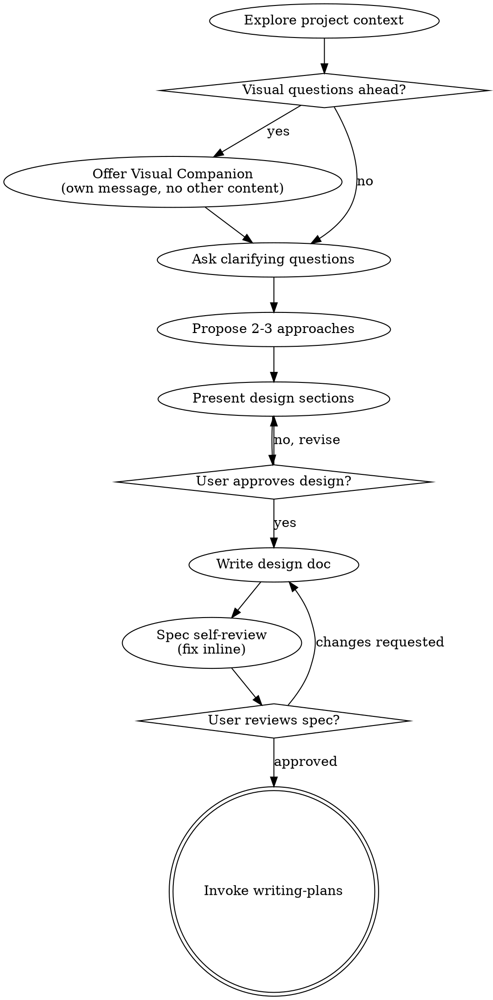

Help turn ideas into fully formed designs and specs through natural collaborative dialogue.

<HARD-GATE>
Do NOT invoke any implementation skill, write any code, scaffold any project, or take any implementation action until you have presented a design and the user has approved it. This applies to EVERY project regardless of perceived simplicity.
</HARD-GATE>

## When NOT to Use

- The task is purely operational (deploy, config change, dependency update)
- A written spec already exists and is approved
- The user explicitly says "no design needed, just build it"

## Checklist

Create a task for each of these items and complete them in order:

1. **Explore project context** — check files, docs, recent commits
2. **Offer visual companion** — ask if diagrams or wireframes would help. Offer in its own message, not combined with questions.
3. **Ask clarifying questions** — one at a time, understand purpose/constraints/success criteria
4. **Propose 2-3 approaches** — with trade-offs and your recommendation
5. **Present design** — in sections scaled to their complexity, get approval after each section
6. **Write design doc** — save to `docs/specs/YYYY-MM-DD-<topic>-design.md` and commit
7. **Spec self-review** — check for: placeholders, contradictions, ambiguity, scope
8. **User reviews written spec** — wait for explicit approval
9. **Transition to implementation** — invoke `atlas:writing-plans` NOT an implementation skill

**The terminal state is invoking writing-plans.** Do NOT invoke any implementation skill. The ONLY skill you invoke after brainstorming is `atlas:writing-plans`.

## Anti-Pattern: "This Is Too Simple To Need A Design"

Every project goes through this process. A todo list, a single-function utility, a config change — all of them. "Simple" projects are where unexamined assumptions cause the most wasted work. The design can be short, but you MUST present it and get approval.

| Claim | Reality |
|-------|---------|
| "It's just a button" | What color? What state? What does it do? Where does it go? |
| "We already discussed this" | The spec serves as a record. New details emerge in writing. |
| "I've done this a hundred times" | This project has unique constraints you haven't explored yet. |
| "The user will get bored" | The user will be happier with a working result than a fast wrong one. |

## Sub-Project Decomposition

If the request describes multiple independent subsystems (e.g., "build a platform with chat, file storage, billing, and analytics"), flag this immediately. Don't spend questions refining details of a project that needs to be decomposed first.

If the project is too large for a single spec, help the user decompose into sub-projects: what are the independent pieces, how do they relate, what order should they be built? Then brainstorm the first sub-project through the normal design flow. Each sub-project gets its own spec → plan → implementation cycle.

## Design for Isolation and Clarity

Break the system into smaller units that each have one clear purpose, communicate through well-defined interfaces, and can be understood and tested independently.

For each unit, you should be able to answer: what does it do, how do you use it, and what does it depend on? Can someone understand what a unit does without reading its internals? Can you change the internals without breaking consumers? If not, the boundaries need work.

## Working in Existing Codebases

Explore the current structure before proposing changes. Follow existing patterns. Where existing code has problems that affect the work (e.g., a file that's grown too large, unclear boundaries, tangled responsibilities), include targeted improvements as part of the design.

Don't propose unrelated refactoring. Stay focused on what serves the current goal.

## Spec Self-Review

After writing the spec document, look at it with fresh eyes:

1. **Placeholder scan:** Any "TBD", "TODO", incomplete sections, or vague requirements? Fix them.
2. **Internal consistency:** Do any sections contradict each other? Does the architecture match the feature descriptions?
3. **Scope check:** Is this focused enough for a single implementation plan, or does it need decomposition?
4. **Ambiguity check:** Could any requirement be interpreted two different ways? If so, pick one and make it explicit.

Fix any issues inline. No need to re-review — just fix and move on.

## User Review Gate

After the spec review loop passes, ask the user to review the written spec before proceeding:

> "Spec written at `<path>`. Please review it and let me know if you want to make any changes before we start the implementation plan."

Wait for the user's response. If they request changes, make them and re-run the spec review. Only proceed once the user approves.

## Key Principles

- **One question at a time** — Don't overwhelm with multiple questions
- **YAGNI ruthlessly** — Remove unnecessary features from all designs
- **Explore alternatives** — Always propose 2-3 approaches before settling
- **Incremental validation** — Present design, get approval before moving on
- **Be flexible** — Go back and clarify when something doesn't make sense
