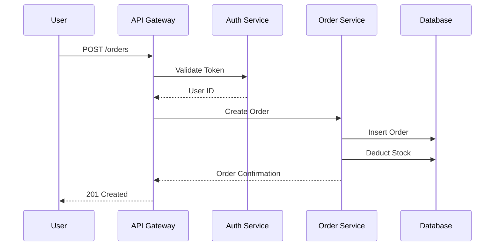
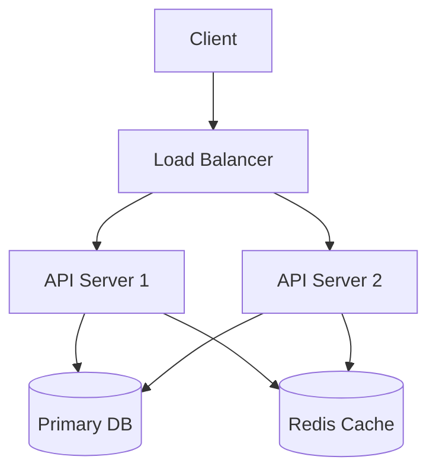

# Architecture Recovery Reference

Systematic process for recovering architecture from code when no documentation exists.

## Architecture Recovery Process

### 1. Run Dependency Graph Tools

**depcruise (TypeScript/JavaScript):**
```bash
# Install
npm install -g dependency-cruiser

# Generate dependency graph
depcruise --include-only "^src" --output-type dot src | dot -T svg > deps.svg

# List circular dependencies
depcruise --include-only "^src" --output-type err src

# Filter by module
depcruise --include-only "^src/services" --output-type dot src | dot -T svg > services-deps.svg
```

**go mod graph (Go):**
```bash
# Export dependency graph
go mod graph > mod-graph.txt

# Visualize
go mod graph | sed 's/@[^ ]*//g' | sort -u | \
  awk '{print "\""$1"\" -> \""$2"\""}' | \
  dot -T svg > go-deps.svg

# Show package imports for a specific package
go list -f '{{.Imports}}' ./internal/service/
```

**pipdeptree (Python):**
```bash
# Install
pip install pipdeptree

# Show dependency tree
pipdeptree

# List conflicting dependencies
pipdeptree --warn

# Output as JSON
pipdeptree --json
```

**madge (JavaScript/TypeScript):**
```bash
# Install
npm install -g madge

# Generate dependency graph
madge --image deps.svg src/

# Detect circular dependencies
madge --circular src/

# Show module boundaries
madge --image modules.svg --extensions ts,tsx src/
```

### 2. C4 Mapping

Map the codebase to the C4 model levels:

**Level 1: Context (System Scope)**
```
+------------------+     +------------------+
|                  |     |                  |
|   User Browser   +---->+   API Gateway    |
|                  |     |                  |
+------------------+     +--------+---------+
                                  |
                                  v
                          +-------+---------+
                          |                 |
                          |   Billing Svc   |
                          |                 |
                          +-----------------+
```

Ask: Who are the users? What external systems does this interact with?

**Level 2: Container (Application Boundaries)**
```
+------------------+     +------------------+     +------------------+
|   Web App        |     |   Backend API    |     |   Background     |
|   (Next.js)      +---->+   (FastAPI)      +---->+   Worker (Celery)|
|                  |     |                  |     |                  |
+------------------+     +--------+---------+     +--------+---------+
                                  |                         |
                                  v                         v
                          +-------+---------+     +---------+--------+
                          |   PostgreSQL    |     |   Redis Queue    |
                          |                 |     |                  |
                          +-----------------+     +------------------+
```

Ask: What are the deployable units? What runs in what process?

**Level 3: Component (Module Boundaries)**
```
+---------------------------+
|   Backend API             |
|  +----------+ +---------+ |
|  | Auth     | | Order   | |
|  | Module   | | Module  | |
|  +----------+ +---------+ |
|  +----------+ +---------+ |
|  | Payment  | | User    | |
|  | Module   | | Module  | |
|  +----------+ +---------+ |
+---------------------------+
```

Ask: What are the internal modules? How do they communicate?

**Level 4: Code (File/Class Level)**
```
src/
  auth/
    auth-handler.ts       # Entry point for /auth/*
    auth-service.ts       # Token generation, password hashing
    auth-middleware.ts    # JWT verification middleware
  orders/
    order-handler.ts      # Entry point for /orders/*
    order-service.ts      # Business logic
    order-repository.ts   # Database access
```

Ask: What files implement each component?

### 3. Data Flow Diagramming (Mermaid)

Create data flow diagrams for key features:



Mermaid syntax for architecture diagrams:



### 4. ADR Discovery

Search locations for Architecture Decision Records:

| Directory to check | Notes |
|--------------------|-------|
| `docs/adr/` | Most common — numbered files (0001-*.md) |
| `docs/decisions/` | Alternative naming |
| `docs/rfcs/` | RFC-style records |
| `docs/architecture/` | May contain ADRs or diagrams |
| `adr/` | Root-level ADR directory |
| `doc/arch/` | Another variant |

Search command:
```bash
find . -type f \( -name "*.md" -o -name "*.rst" \) | xargs grep -l -i "decision\|adr\|rationale\|why" | head -20
```

Read ADRs in chronological order (by number or date). The first ADR (0001) usually explains the founding architecture decisions.

### 5. Architecture Style Determination

Match the codebase to a known architecture style:

| Signs | Likely Style |
|-------|-------------|
| Controllers → Services → Repositories | Layered Architecture |
| Handlers → Use Cases → Entities | Clean Architecture / Hexagonal |
| Event emitters, handlers, buses | Event-Driven Architecture |
| Message queue consumers + producers | Microservices / Message-Driven |
| Single request handler, no layering | Monolith / Script |
| Command handlers, query handlers | CQRS |
| Modules with own DB, API gateways | Microservices |
| Plugin directories, extension points | Plugin Architecture |
| Middleware wrapping all requests | Pipe and Filter |

### 6. Output Artifacts

Produce three artifacts in `docs/scout-notes/`:

**1. Architecture Overview (1 page)**
```
Project: Atlas Pipeline
Architecture Style: Layered (Pipeline-based)
Entry Points: pipeline.ts (run), pipeline.ts (status), pipeline.ts (reroute)
Containers: Plugin -> Subagents (10) -> Logging
Data Flow: Task -> Pipeline -> Subagents -> Output
Key ADR: adr/0001-pipeline-order.md
```

**2. Context Diagram (1 page)**
```
         +---------+
         | User    |
         +----+----+
              |
              v
      +-------+--------+
      |   Atlas Agent  |
      +-------+--------+
              |
     +--------+--------+
     |                  |
     v                  v
+---------+      +------------+
| Plugin  |      | Subagents  |
| Layer   |      | (10 agents)|
+---------+      +------------+
```

**3. Key Files Map (1 page)**
```
src/
  main.ts                  # Entry point
  config/                  # Configuration
    env.ts                 # Environment config
  routes/                  # Route definitions
    index.ts               # Route aggregator
  middleware/              # Middleware chain
    auth.ts                # Authentication
    logging.ts             # Request logging
    validation.ts          # Input validation
  services/                # Business logic
    user-service.ts        # User operations
    order-service.ts       # Order operations
  data/                    # Data access
    repositories/          # Database access
    migrations/            # Schema migrations
docs/
  adr/                     # Architecture decisions
  0001-pipeline-order.md   # Founding ADR
```
