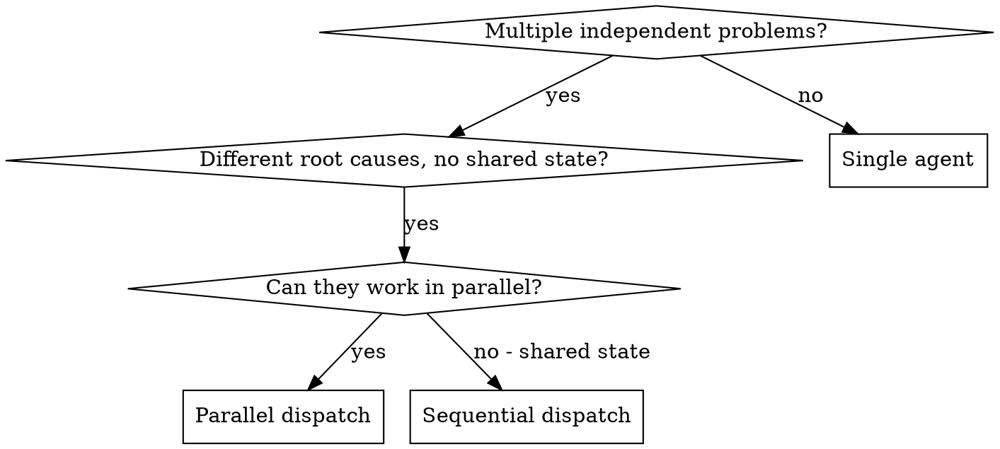

You delegate tasks to specialized agents with isolated context. By precisely crafting their instructions and context, you ensure they stay focused and succeed at their task. They should never inherit your session's context or history — you construct exactly what they need.

**Core principle:** Dispatch one agent per independent problem domain. Let them work concurrently.

## When NOT to Use

- Tasks share state or have dependencies on each other
- Tasks modify the same files (will cause conflicts)
- Full system state understanding is needed for each task
- Failures are related (fix one might fix others)
- Exploratory — you don't know what's broken yet

## When to Use



**Use when:**
- 3+ test files failing with different root causes
- Multiple subsystems broken independently
- Each problem can be understood without context from others
- No shared state between tasks

## The Pattern

### 1. Identify Independent Domains

Group failures by what's broken. Each domain is independent — fixing one doesn't affect others.

### 2. Create Focused Agent Tasks

Good agent prompts are:
1. **Focused** — one clear problem domain
2. **Self-contained** — all context needed to understand the problem
3. **Specific about output** — what should the agent return?
4. **Constrained** — what should the agent NOT do?

```markdown
Fix the 3 failing tests in src/agents/agent-tool-abort.test.ts:

1. "should abort tool with partial output capture" — expects 'interrupted at' in message
2. "should handle mixed completed and aborted tools" — fast tool aborted instead of completed
3. "should properly track pendingToolCount" — expects 3 results but gets 0

Your task:
1. Read the test file and understand what each test verifies
2. Identify root cause — timing issues or actual bugs?
3. Fix by replacing timeouts with event-based waiting
4. Do NOT just increase timeouts — find the real issue

Return: Summary of what you found and what you fixed.
```

### 3. Dispatch in Parallel

Use OpenCode subagent dispatch for each task independently.

### 4. Review and Integrate

When agents return:
- Read each summary
- Verify fixes don't conflict
- Run full test suite
- Integrate all changes

## Agent Prompt Structure — Good vs Bad

**❌ Too broad:** "Fix all the tests" — agent gets lost
**✅ Specific:** "Fix agent-tool-abort.test.ts" — focused scope

**❌ No context:** "Fix the race condition" — agent doesn't know where
**✅ Context:** Paste the error messages and test names

**❌ No constraints:** Agent might refactor everything
**✅ Constraints:** "Do NOT change production code"

**❌ Vague output:** "Fix it" — you don't know what changed
**✅ Specific:** "Return summary of root cause and changes"

## Real Example

**Scenario:** 6 test failures across 3 files after major refactoring.

**Failures:**
- agent-tool-abort.test.ts: 3 failures (timing issues)
- batch-completion-behavior.test.ts: 2 failures (tools not executing)
- tool-approval-race-conditions.test.ts: 1 failure (execution count = 0)

**Decision:** Independent domains — abort logic separate from batch completion separate from race conditions.

**Dispatch (parallel):**
- Agent 1 → Fix agent-tool-abort.test.ts
- Agent 2 → Fix batch-completion-behavior.test.ts
- Agent 3 → Fix tool-approval-race-conditions.test.ts

**Results:**
- Agent 1: Replaced timeouts with event-based waiting
- Agent 2: Fixed event structure bug (threadId in wrong place)
- Agent 3: Added wait for async tool execution to complete

**Integration:** All fixes independent, no conflicts, full suite green.

## Anti-Patterns

| Pattern | Problem | Fix |
|---------|---------|-----|
| Dispatching related tasks in parallel | Merge conflicts, inconsistent solutions | Use sequential execution for related tasks |
| Not reviewing results for conflicts | Incompatible changes | Always review and integrate after parallel dispatch |
| Giving each agent full session context | Wasted tokens, context pollution | Craft precise, minimal instructions per agent |
| Vague agent prompts | Wrong results, wasted time | Include scope, constraints, context, and expected output |

## Verification

After agents return:
1. **Review each summary** — understand what changed
2. **Check for conflicts** — did agents edit same code?
3. **Run full suite** — verify all fixes work together
4. **Spot check** — agents can make systematic errors

## Quality Checklist

- [ ] All tasks confirmed independent
- [ ] No shared state between tasks
- [ ] Each agent gets precise, isolated context
- [ ] Constraints clearly stated (what NOT to do)
- [ ] Expected output format specified
- [ ] Results reviewed for conflicts before integration
- [ ] Full test suite run after integration
