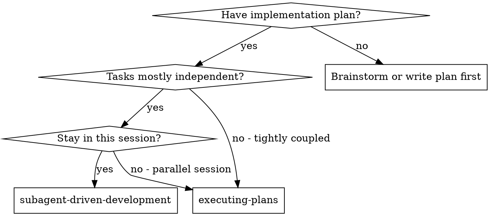
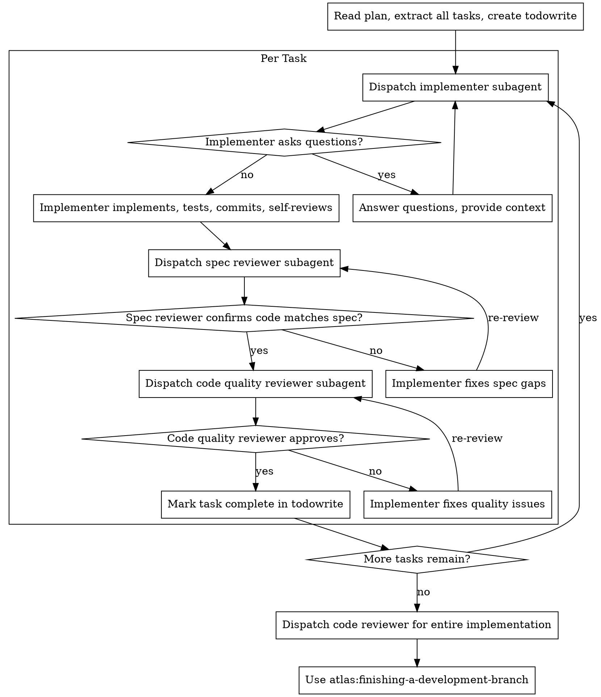

Execute plan by dispatching fresh subagent per task, with two-stage review after each: spec compliance review first, then code quality review.

**Core principle:** Fresh subagent per task + two-stage review (spec first, then quality) = high quality, fast iteration.

**Continuous execution:** Do not pause to check in with the human partner between tasks. Execute all tasks from the plan without stopping. The only reasons to stop are: BLOCKED status you cannot resolve, ambiguity that genuinely prevents progress, or all tasks complete.

## When NOT to Use

- Tasks are tightly coupled and cannot be isolated
- No subagents are available (use executing-plans instead)
- The plan doesn't exist yet (use writing-plans first)

## When to Use

**vs. Executing Plans (parallel session):**
- Same session (no context switch)
- Fresh subagent per task (no context pollution)
- Two-stage review after each task
- Faster iteration (no human-in-loop between tasks)

## The Process

## Model Selection

Use the least powerful model that can handle each role to conserve cost.

**Mechanical implementation** (isolated functions, clear specs, 1-2 files): use a fast, cheap model.

**Integration and judgment** (multi-file coordination, pattern matching, debugging): use a standard model.

**Architecture, design, and review**: use the most capable available model.

**Task complexity signals:**
- Touches 1-2 files with complete spec → cheap model
- Touches multiple files with integration concerns → standard model
- Requires design judgment or broad codebase understanding → most capable model

## Implementer Status Handling

| Status | Action |
|--------|--------|
| DONE | Proceed to spec review |
| DONE_WITH_CONCERNS | Review concerns, fix if needed, proceed |
| NEEDS_CONTEXT | Provide missing context, re-dispatch |
| BLOCKED | Assess: context problem? needs better model? task too large? wrong plan? |

**Never** ignore an escalation or force the same model to retry without changes. If the implementer said it's stuck, something needs to change.

## Prompt Templates

- `implementer-prompt.md` — Dispatch implementer subagent
- `spec-reviewer-prompt.md` — Dispatch spec compliance reviewer
- `code-quality-reviewer-prompt.md` — Dispatch code quality reviewer

## Anti-Patterns

| Pattern | Problem | Fix |
|---------|---------|-----|
| Dispatching multiple implementers in parallel | File conflicts, merge hell | One task at a time, sequentially |
| Skipping the spec review | Over-building or under-building | Spec review before quality review |
| Sharing full session history with subagent | Context pollution, wasted tokens | Craft precisely what the subagent needs |
| Proceeding with unfixed review issues | Accumulated debt | Fix every issue before next task |
| Letting implementer self-review replace actual review | Both are needed | Both spec AND quality review required |
| Starting quality review before spec compliance is ✅ | Wrong order | Spec review first, then quality |
| Moving to next task while reviews have open issues | Broken workflow | Don't proceed until all issues fixed |

## Advantages

**vs. Manual execution:**
- Subagents follow TDD naturally
- Fresh context per task (no confusion)
- Subagent can ask questions before AND during work
- Parallel-safe (subagents don't interfere)

**vs. Executing Plans:**
- Same session (no handoff)
- Continuous progress (no waiting)
- Review checkpoints automatic

**Efficiency gains:**
- No file reading overhead (controller provides full context)
- Controller curates exactly what's needed
- Subagent gets complete information upfront
- Questions surfaced before work begins

**Quality gates:**
- Self-review catches issues before handoff
- Two-stage review ensures nothing slips
- Review loops ensure fixes actually work
- Spec compliance prevents over/under-building

## Integration

**Required workflow skills:**
- `atlas:writing-plans` — Creates the plan this skill executes
- `atlas:requesting-code-review` — Code review for reviewer subagents
- `atlas:finishing-a-development-branch` — Complete development after all tasks
- `atlas:test-driven-development` — Subagents follow TDD for each task

**Alternative:**
- `atlas:executing-plans` — Use for parallel session instead of same-session execution

## Quality Checklist

- [ ] All tasks extracted into todowrite before starting
- [ ] Each implementer gets precise, isolated context (not session history)
- [ ] Spec compliance review done before quality review
- [ ] Issues fixed before proceeding to next task
- [ ] Final code review dispatched after all tasks
- [ ] Finishing-a-development-branch invoked at the end
