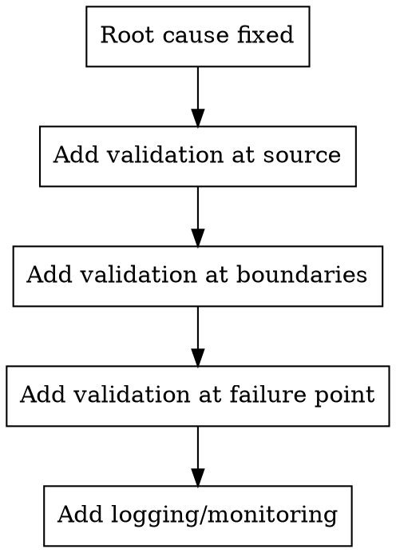

# Defense in Depth

## Overview

After finding root cause and applying the fix, add validation at multiple layers to catch similar issues early and make future debugging faster.

## The Pattern

### Layer 1: Source — Where the bad value originates

- Validate inputs at the entry point
- Reject invalid data early with clear errors
- Type-check or schema-validate at API boundaries

### Layer 2: Boundaries — Where data crosses components

- Assert invariants at module/function boundaries
- Validate data format between layers
- Check preconditions and post-conditions

### Layer 3: Failure point — Where the bug manifested

- Add defensive checks that fail fast
- Log diagnostic context for future debugging
- Include enough info to trace backward

### Layer 4: Monitoring — Long-term visibility

- Add metrics for this failure mode
- Log unexpected states
- Alert on repeated failures

## Example

**Bug:** User ID is null when processing a webhook.

**Fix:** Validate webhook payload at the handler.

**Defense in depth:**
1. **Source:** Add JSON schema validation to webhook endpoint
2. **Boundary:** Assert user_id is non-null before passing to service layer
3. **Failure point:** Add null check with clear error message
4. **Monitoring:** Log webhook validation failures with payload ID

## When NOT to Use

- Prototype code (add only at critical boundaries)
- The fix itself is a validation (don't duplicate)
- Adding validation would obscure the real issue
