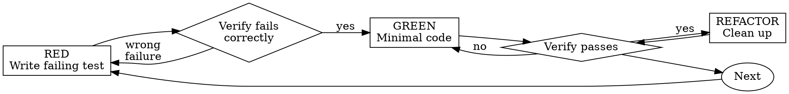

Write the test first. Watch it fail. Write minimal code to pass.

**Core principle:** If you didn't watch the test fail, you don't know if it tests the right thing.

**Violating the letter of the rules is violating the spirit of the rules.**

## When NOT to Use

- Throwaway prototypes (ask your human partner first)
- Generated code (scaffolding, boilerplate)
- Configuration files without logic

## The Iron Law

**NO PRODUCTION CODE WITHOUT A FAILING TEST FIRST.**

If you wrote code before the test, delete it and start over. No exceptions.

## Red-Green-Refactor



### RED — Write Failing Test

Write one minimal test showing what should happen. One behavior. Clear name. Real code (no mocks unless unavoidable).

```typescript
test('retries failed operations 3 times', async () => {
  let attempts = 0;
  const operation = () => {
    attempts++;
    if (attempts < 3) throw new Error('fail');
    return 'success';
  };
  const result = await retryOperation(operation);
  expect(result).toBe('success');
  expect(attempts).toBe(3);
});
```

### Verify RED — Watch It Fail

**MANDATORY. Never skip.**

Confirm the test fails (not errors). Failure message is expected. Fails because feature missing, not typos.

### GREEN — Minimal Code

Write simplest code to pass the test. Don't add features, refactor, or improve beyond the test.

```typescript
async function retryOperation<T>(fn: () => Promise<T>): Promise<T> {
  for (let i = 0; i < 3; i++) {
    try { return await fn(); }
    catch (e) { if (i === 2) throw e; }
  }
  throw new Error('unreachable');
}
```

### Verify GREEN — Watch It Pass

**MANDATORY.** Run the test. Confirm it passes. Confirm other tests still pass.

### REFACTOR — Clean Up

After green only: remove duplication, improve names, extract helpers. Keep tests green.

### Repeat

Next failing test for next feature.

## Good Tests

| Quality | Description |
|---------|-------------|
| Minimal | One thing only. No "and" in the name. |
| Clear | Name describes the behavior being tested. |
| Shows intent | Demonstrates how the API should be used. |
| Independent | Order-independent, no shared state. |

## Why Order Matters

**"I'll write tests after to verify it works"**

Tests written after code pass immediately. Passing immediately proves nothing:
- Might test wrong thing
- Might test implementation, not behavior
- Might miss edge cases
- You never saw it catch the bug

Test-first forces you to see the test fail, proving it actually tests something.

**"Deleting X hours of work is wasteful"**

Sunk cost fallacy. The time is already gone. Your choice now:
- Delete and rewrite with TDD (high confidence)
- Keep it and add tests after (low confidence, likely bugs)

The "waste" is keeping code you can't trust. Working code without real tests is technical debt.

**"TDD is dogmatic, being pragmatic means adapting"**

TDD IS pragmatic:
- Finds bugs before commit (faster than debugging after)
- Prevents regressions (tests catch breaks immediately)
- Documents behavior (tests show how to use code)
- Enables refactoring (change freely, tests catch breaks)

"Pragmatic" shortcuts = debugging in production = slower.

## Example: Bug Fix

**Bug:** Empty email accepted.

**RED:**
```typescript
test('rejects empty email', async () => {
  const result = await submitForm({ email: '' });
  expect(result.error).toBe('Email required');
});
```

**Verify RED:** `npm test` → FAIL: expected 'Email required', got undefined.

**GREEN:**
```typescript
function submitForm(data: FormData) {
  if (!data.email?.trim()) {
    return { error: 'Email required' };
  }
  // ...
}
```

**Verify GREEN:** `npm test` → PASS.

**REFACTOR:** Extract validation for multiple fields if needed.

## Verification Checklist

- [ ] Every new function/method has a test
- [ ] Watched each test fail before implementing
- [ ] Each test failed for expected reason (feature missing, not typo)
- [ ] Wrote minimal code to pass each test
- [ ] All tests pass
- [ ] Tests use real code (mocks only if unavoidable)
- [ ] Edge cases and errors covered

## When Stuck

| Problem | Solution |
|---------|----------|
| Don't know how to test | Write wished-for API. Write assertion first. |
| Test too complicated | Design too complicated. Simplify interface. |
| Must mock everything | Code too coupled. Use dependency injection. |
| Test setup huge | Extract helpers. Still complex? Simplify design. |

## Red Flags

| Rationalization | Reality |
|----------------|---------|
| "I'll write tests after" | You won't. Or you'll write tests that pass against already-working code. |
| "Deleting X hours of work is wasteful" | Keeping untested code is more wasteful. |
| "This is too simple to need a test first" | Then the test is simple too. No excuse. |
| "I'll just verify manually" | Manual verification is not repeatable. Tests are. |
| "Tests after achieve the same goals" | Tests-after verify what you built, not what's required. |
| "I already manually tested all edge cases" | No record. Can't re-run. Easy to forget cases. |
| "TDD is dogmatic" | TDD is pragmatic — faster than debugging. |

## Final Rule

Production code → test exists and failed first. Otherwise → not TDD. No exceptions.
